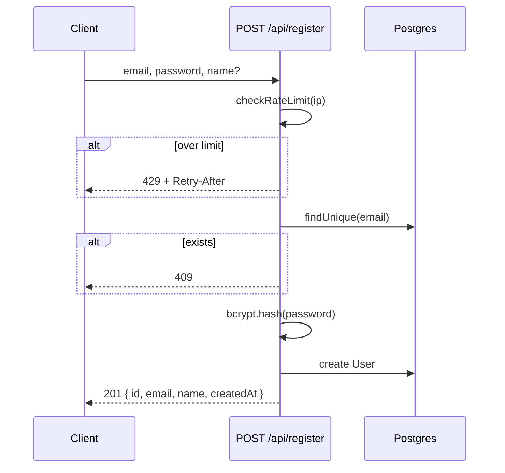
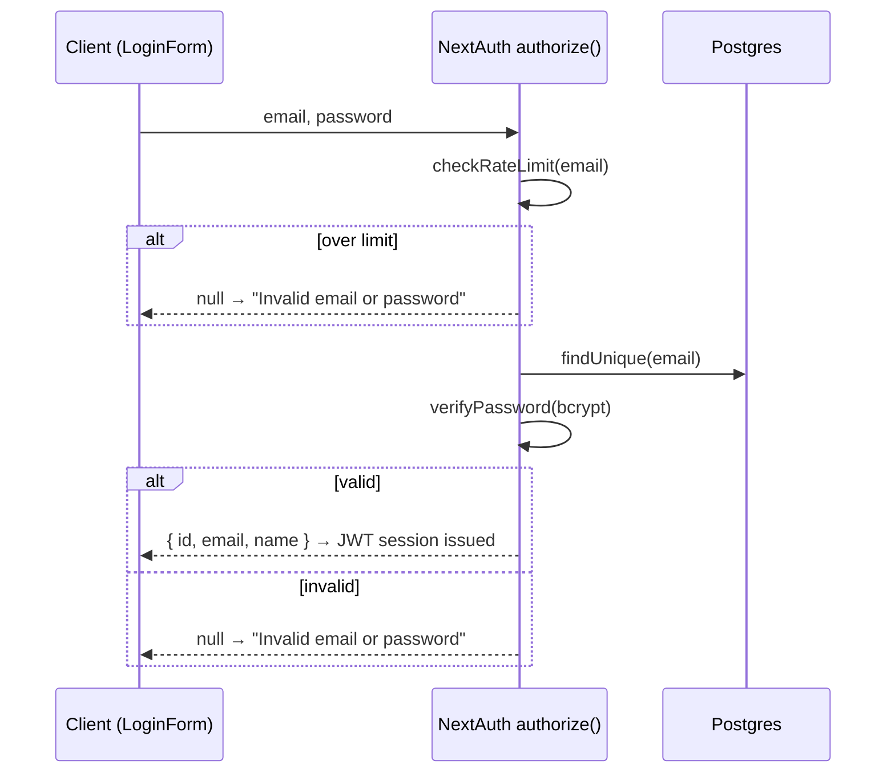
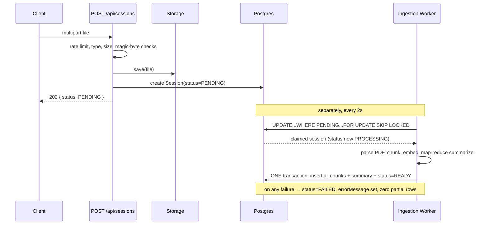
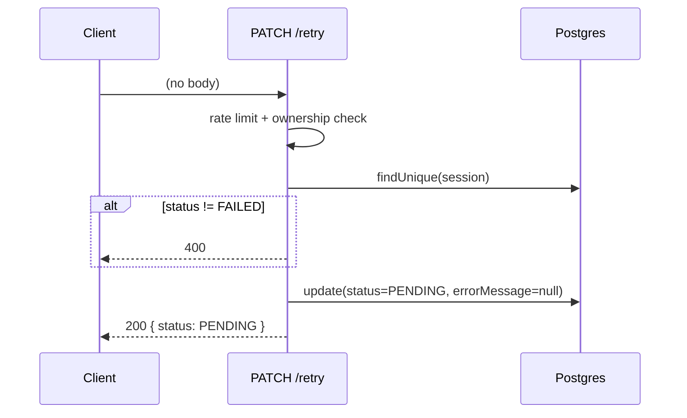
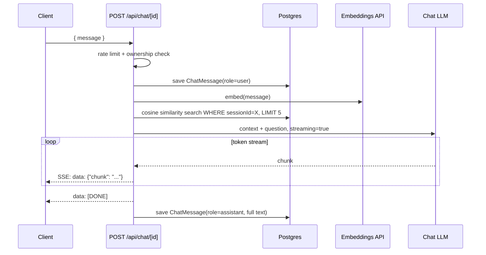

# LexiPDF — Architecture, Decisions & Interview Prep

*A single reference covering what we built, how, why we chose each path over the alternatives, and where this goes next. Written to be read cold, once, and walk into an interview able to defend every choice.*

---

## 1. TL;DR

LexiPDF is a web app where you upload a PDF and chat with it — ask questions, get a summary — using an LLM that only ever sees the text of *your* document, never anyone else's. It's built as a single Next.js application (frontend + API in one codebase), running entirely on free-tier AI APIs (Groq for chat, HuggingFace for embeddings) and a self-hosted Postgres database that doubles as both the relational store and the vector search index. The whole thing is designed to run for $0 in API costs and deploy with one `docker compose up`.

---

## 2. Product Overview (non-technical)

**The problem:** long PDFs (contracts, research papers, resumes, reports) are slow to read and easy to lose track of. People want to ask a document a question and get a direct answer, not skim 40 pages.

**The user journey:**
1. Register / log in.
2. Drag a PDF onto the dashboard. The upload finishes in under a second — you're not staring at a spinner while the AI does its work.
3. The document appears with a small "processing" indicator while, in the background, the system reads it, breaks it into chunks, and builds a summary.
4. Once ready, you get an auto-generated summary and can ask it anything. Answers stream in word-by-word.
5. Every document lives in its own **session** — upload a second PDF and it's a completely separate conversation with zero chance of the first document's content leaking into it.

**Why the isolation guarantee is a real product feature, not just an implementation detail:** if this were a multi-tenant SaaS product, "your PDF's contents can never appear in another user's chat" is the single sentence that has to be true 100% of the time, or the product is unsellable. We didn't implement isolation as an afterthought filter — it's baked into the database query itself (more on this in §7), so it's a *structural* guarantee, not a "we remembered to check" guarantee.

**Why "free-tier stack" is a deliberate framing, not a cost-cutting compromise:** every external dependency (Groq for the LLM, HuggingFace for embeddings) was chosen specifically because it has a real, perpetual free tier suitable for a small self-hosted app — this was an explicit constraint from day one of this phase of the project, not something we backed into after hitting a bill.

---

## 3. System Architecture (technical)

### Stack

| Layer | Choice |
|---|---|
| Framework | Next.js 14 (App Router) — server components, API routes, and the frontend all in one codebase |
| Auth | NextAuth v4, Credentials provider, JWT sessions |
| Database | PostgreSQL + the `pgvector` extension (one database for relational data *and* vector search) |
| ORM | Prisma (schema/migrations/typed queries), dropping to raw `$queryRaw`/`$executeRaw` specifically for vector search and batched inserts |
| AI orchestration | LangChain (LCEL), with a provider-swap layer so the chat model and embeddings model are each independently configurable |
| Default LLM | Groq, model `openai/gpt-oss-120b` |
| Default embeddings | HuggingFace Inference API, `sentence-transformers/all-MiniLM-L6-v2` (384-dim) |
| Fallback providers | Google Gemini, OpenAI (both LLM and embeddings) |
| Background processing | An in-process worker polling Postgres — no Redis, no queue service |
| Rate limiting | In-memory (`lru-cache`), no Redis |
| Frontend styling | Tailwind v4, a dark glassmorphism theme, `framer-motion` for animation, `react-three-fiber` for a 3D hero visual |
| Chat rendering | `react-markdown` + `remark-gfm` |
| Deployment | Docker multi-stage build + `docker-compose` (app + Postgres) |

### Request lifecycle (upload → chat)

```
Upload PDF
  → POST /api/sessions saves the file, creates a Session row (status: PENDING), responds 202 *immediately*
  → (separately, async) in-process worker polls Postgres, claims the PENDING row
      → parses PDF → splits into ~1000-char chunks → embeds each chunk
      → map-reduce summarizes the chunks
      → ONE transaction: insert all chunks + write summary + flip status to READY
  → frontend polls GET /api/sessions/[id] every 2s until status is READY or FAILED

Chat message
  → POST /api/chat/[sessionId]
  → embed the user's question
  → cosine-similarity search in Postgres, scoped to this sessionId only
  → top-5 matching chunks + the question → the chat LLM, streamed
  → answer streamed to the browser via Server-Sent Events, saved to DB when done
```

### How the four phases of this project map onto the current code

| Phase (git history) | What it built |
|---|---|
| Initial scaffold | Basic Next.js app, OpenAI-only, synchronous ingestion, local file storage |
| Parallel UI branch (never merged directly) | Dark theme, landing page, framer-motion, 3D hero — later manually ported in |
| Iteration 2 (backend) | Groq + HuggingFace providers, transactional pipeline, async worker + polling, retry endpoint |
| Iteration 3 (hardening) | Auth redirect fix, rate limiting, LLM retry tuning, magic-byte upload validation, Docker deployment, this UI port + markdown rendering fix |

---

## 4. Decision Log — "Why This, Not That"

This is the section to actually rehearse. Each entry: **what we chose → what else we considered → why → what we gave up.**

### 4.1 Next.js full-stack monolith vs. separate frontend/backend
**Chose:** one Next.js app serving both the React frontend and the API routes.
**Alternative:** a separate Express/FastAPI backend with a decoupled frontend (React/Vite).
**Why:** for a single-developer project of this size, a monolith removes an entire class of problems — CORS, duplicated auth logic, two deploy pipelines, two sets of environment variables. App Router route handlers give us real server-side code (Prisma, filesystem access, LangChain) colocated with the pages that need it.
**Trade-off:** harder to scale the frontend and backend independently later, and Next.js API routes are less feature-rich than a dedicated backend framework for things like complex middleware chains.

### 4.2 NextAuth + Credentials provider vs. OAuth-only vs. hand-rolled JWT
**Chose:** NextAuth v4 with a Credentials provider (email + bcrypt-hashed password), JWT session strategy.
**Alternative:** OAuth-only (Google/GitHub login), or writing JWT issuance/verification by hand.
**Why:** Credentials keeps signup frictionless for a demo/personal project (no OAuth app registration needed), while NextAuth still gives us CSRF protection, secure cookie handling, and session management for free — writing that by hand is a well-known way to introduce a security bug.
**Trade-off:** no social login, and we own password storage/reset flows ourselves (password reset isn't built yet — see §10).

### 4.3 Postgres + pgvector vs. a dedicated vector database
**Chose:** pgvector extension inside the same Postgres instance already used for relational data.
**Alternative:** Pinecone, Weaviate, Milvus, Qdrant.
**Why:** one database to run, back up, and reason about. Critically, it lets the **session-isolation guarantee live in the same SQL query as the vector search** (`WHERE "sessionId" = X AND embedding <=> ...`) instead of being a separate access-control layer bolted onto an external vector store's API. An HNSW index (`prisma/migrations/0001_init_pgvector.sql`) keeps the similarity search fast without needing a specialized system.
**Trade-off:** a dedicated vector DB would out-scale Postgres at very high vector counts/query volume, and some (Pinecone) have more advanced filtering/hybrid-search features out of the box.

### 4.4 Prisma vs. raw SQL — and why raw SQL still shows up
**Chose:** Prisma for the schema, migrations, and 90% of queries; raw `$queryRaw`/`$executeRaw` specifically for the vector similarity search and the batched multi-row chunk insert.
**Why:** Prisma doesn't (and can't easily) generate the `<=>` cosine-distance operator pgvector needs, and a multi-row `INSERT ... VALUES (...),(...),...` is meaningfully faster than N sequential Prisma `.create()` calls for hundreds of chunks. Everywhere else, Prisma's type safety and migration story win outright.
**Trade-off:** raw SQL loses Prisma's compile-time type checking on those specific queries — correctness there is developer-verified, not compiler-verified.

### 4.5 LangChain vs. calling provider SDKs directly
**Chose:** LangChain (LCEL `RunnableSequence`, not the deprecated `RetrievalQAChain`) as the orchestration layer.
**Why:** one interface (`getChatLLM()` / `getEmbeddingsClient()`) in front of four different providers (Groq, Gemini, OpenAI, HuggingFace), so switching providers is an env-var change, not a rewrite. LangChain also gives every client a shared retry/backoff mechanism (`AsyncCaller`) for free.
**Trade-off:** an abstraction layer to understand when something goes wrong underneath it (see 4.6's incident, and the retry-tuning story in 4.11) — LangChain's defaults aren't always right for a given use case, and you have to know to override them.

### 4.6 Groq as the default LLM — including a live deprecation incident
**Chose:** Groq, model `openai/gpt-oss-120b`, accessed via `ChatOpenAI` pointed at Groq's OpenAI-compatible endpoint (`baseURL` override) rather than the official `@langchain/groq` package.
**Why not `@langchain/groq`:** it requires `@langchain/core@^1.x`, which conflicts with the `@langchain/openai`/`@langchain/google-genai` versions already pinned in this project (`^0.3.x`). Since Groq's API is OpenAI-compatible, reusing the already-installed `ChatOpenAI` client avoids a second, incompatible major version of the whole LangChain dependency tree.
**The incident:** mid-project, the originally-chosen model `llama-3.3-70b-versatile` started returning `404 model does not exist`. Diagnosis: Groq deprecated it on 2026-06-17, weeks before this was hit. This is a real, live example of a "production bug you fixed" — root-caused via web research (confirming the deprecation and Groq's own recommended replacement), fixed by switching to `openai/gpt-oss-120b`, and verified end-to-end (upload → summary → chat) with the real API key before calling it done.
**Trade-off:** free-tier LLMs move fast and deprecate models with short notice — this is an ongoing maintenance cost of choosing a free/fast-moving provider over a more stable (and paid) one.

### 4.7 HuggingFace embeddings (384-dim) vs. Gemini (768) / OpenAI (1536)
**Chose:** HuggingFace Inference API, `sentence-transformers/all-MiniLM-L6-v2`, 384 dimensions — as the default, with the pgvector column sized to match (`vector(384)`).
**Why:** it's free, hosted (no local model download/runtime needed, unlike a `transformers.js` local-inference alternative that was also considered), and Groq itself has zero embeddings endpoint, so an embeddings provider is mandatory regardless of the LLM choice.
**Trade-off — and this is the sharpest one in the whole system:** the pgvector column's dimension is baked into the schema. Switching `EMBEDDING_PROVIDER` later means changing the column type, a full `prisma db push --force-reset`, re-running the HNSW index migration, and **re-uploading every previously-ingested PDF** — there's no in-place re-embedding path. This was a conscious, documented trade-off (see the doc comment in `src/lib/llm/index.ts`), not an oversight.

### 4.8 Asynchronous ingestion vs. blocking the upload request
**Chose:** `POST /api/sessions` saves the file and returns `202` in well under a second; a `Session.status` state machine (`PENDING` → `PROCESSING` → `READY`/`FAILED`) tracks real progress, and the frontend polls until it settles.
**Alternative (what the original scaffold actually did):** parse, embed, and summarize synchronously inside the upload request handler.
**Why:** parsing + embedding + summarizing a large PDF can take well over the typical HTTP/serverless request timeout, and blocking the user on it is a bad UX regardless of timeouts. Decoupling upload from processing also means a slow LLM provider degrades processing latency, not upload latency.
**Trade-off:** more moving parts (a status field, a worker, a polling frontend hook) than the naive synchronous version — more surface area to get wrong, which is exactly why §4.9's transactional design exists.

### 4.9 Postgres-polling worker vs. Redis/BullMQ
**Chose:** a single in-process Node loop (`src/lib/worker/ingestionWorker.ts`) that polls every 2 seconds and claims work with one atomic SQL statement:
```sql
UPDATE "Session" SET status = 'PROCESSING' WHERE id = (
  SELECT id FROM "Session" WHERE status = 'PENDING'
  ORDER BY "createdAt" ASC LIMIT 1 FOR UPDATE SKIP LOCKED
) RETURNING id, "pdfPath"
```
**Alternative:** BullMQ + Redis, or a managed queue (SQS, etc.).
**Why:** this is the single design philosophy repeated at every layer of this project — **no new infrastructure if the existing database can do the job safely.** `FOR UPDATE SKIP LOCKED` is a real, standard Postgres pattern for exactly this ("safely hand one row to exactly one worker"), not a hack. It means zero new services to run, monitor, or pay for.
**Trade-off, stated explicitly and repeatedly in the code:** this is safe for **one app instance**. It is not a substitute for a real queue if this ever needs to run as multiple instances — there's no distributed leader election or cross-instance work redistribution. That's a known, accepted limitation, not something we didn't think about.

### 4.10 Transactional ingestion design
**Chose:** compute everything external (parse, embed, summarize) *before* opening a database transaction; then do all the writes — every chunk insert, the summary, the `READY` status flip — inside one `prisma.$transaction`, using a single batched multi-row `INSERT` rather than one insert per chunk.
**Why:** embeddings/LLM calls are slow, external, and can fail (rate limits, timeouts) — you never want a database transaction open and holding locks while waiting on an HTTP call to a third party. Doing all the slow work first means a failure there touches zero database rows; wrapping only the fast, local writes in a transaction means a failure *there* is atomic — you never end up with, say, half the chunks inserted and no summary.
**Trade-off:** if ingestion fails partway, all the (successfully computed) embeddings for that attempt are thrown away — retrying re-embeds from scratch. Given free-tier embeddings, this is an acceptable cost for correctness.

### 4.11 Local disk storage today vs. Cloudflare R2 (recommended, not yet built)
**Chose:** `LocalFileService` — PDFs live on the container's local filesystem (a Docker named volume in production).
**Recommendation for later:** Cloudflare R2 — perpetual free tier (10GB storage, 1M/10M monthly ops), **unmetered egress**, and a genuinely S3-compatible API (`@aws-sdk/client-s3` works against it via a custom endpoint, no code fork vs. real AWS S3). Backblaze B2 is the fallback if R2's mandatory card-on-file is a blocker.
**Why not implemented yet:** it's explicitly scoped out of this round — and doing it properly surfaced a real latent coupling bug worth knowing about: `StorageProvider.getPath()` is documented to return "an absolute path (local) or URL (S3)," but the ingestion code does a raw `fs.readFile()` on whatever it returns. That works for local storage by accident and would silently break for S3 (you can't `readFile()` a URL) — fixing that (swapping `getPath()` for a storage-agnostic `getBuffer()`) is a prerequisite, not an afterthought, for adding real S3 support.
**Trade-off today:** uploaded files are lost if the storage volume isn't preserved across a redeploy — real production risk, explicitly tracked as open (§10).

### 4.12 In-memory rate limiter vs. Redis-backed
**Chose:** `src/lib/rateLimit.ts` — a fixed-window counter backed by `lru-cache` (automatic TTL eviction, no hand-rolled cleanup), called explicitly at the top of each route handler.
**Why:** same "no new infra" philosophy as §4.9. It was also deliberately *not* built as Next.js middleware — every route handler in this codebase already repeats its own auth/ownership checks rather than sharing a middleware wrapper, so a rate-limit check as an explicit first line matches the codebase's existing style rather than introducing a new pattern.
**Trade-off, explicit:** resets on process restart, not shared across multiple instances — same accepted limitation as the worker.

### 4.13 LLM retry tuning: `maxRetries: 3`, and *not* honoring `Retry-After`
**Chose:** explicitly set `maxRetries: 3` (and `timeout: 30_000` where the client supports it) on every LangChain client construction.
**Why:** investigation revealed every LangChain client silently defaults to **6 retries** with generic exponential backoff via its internal `AsyncCaller`/`p-retry` — undocumented unless you go looking, and enough to make one flaky provider call stack up to 6x latency inside a single user-facing request. Measured concretely: forcing a failure with an invalid API key took **~35+ seconds to fail at the old default of 6**, and **16 seconds at `maxRetries: 3`** — a real, measured improvement, not a guess.
**Explicit non-goal:** this does *not* make retries honor a provider's `Retry-After` header on a 429 — LangChain's generic backoff schedule doesn't read it, and we didn't build a custom `onFailedAttempt` handler to add that. Worth naming directly if asked "did you fully solve backoff" — no, we bounded the damage, we didn't implement provider-aware backoff.

### 4.14 Magic-byte PDF validation as defense-in-depth
**Chose:** check the actual file bytes (`%PDF-` header within the first 1024 bytes, `%%EOF` within the last 1024 bytes — per the PDF spec, neither has to be at byte 0/EOF exactly) before writing anything to storage.
**The bug it fixes:** the only prior check was `file.type !== 'application/pdf'` — a client-supplied multipart header, trivially spoofable by renaming any file and setting the right `Content-Type` on the upload request.
**Explicitly not a replacement for anything:** `pdf-parse` downstream in the worker is still the real correctness check (a file can pass the magic-byte check and still fail a real parse) — this closes the trivial spoof at upload time, before disk/storage is touched, not the deep one.

### 4.15 Docker: skipping `output: 'standalone'`
**Chose:** a normal `next start` production server in the container, with the full `node_modules` copied in — a bigger image than Next.js's "standalone" output mode.
**Why not standalone:** research turned up multiple *currently open* Next.js GitHub issues (including one reported as recently as Feb 2026) where `instrumentation.ts` — the only thing that boots the ingestion worker — silently fails to run under standalone output tracing. Given the worker is completely load-bearing (a silent failure means uploads succeed but nothing ever processes, with zero visible error), the well-trodden non-standalone path was judged the safer default.
**How this was verified, not just assumed:** built the image, ran the container, confirmed the worker's boot log line appeared, then uploaded a real PDF through the running container end-to-end to `READY` — plus hit and fixed two real build issues along the way (Prisma's engine-detection needing `openssl` explicitly installed on `node:20-slim`'s default OpenSSL 3, and the project having no `public/` directory at all for the Dockerfile to `COPY`).

### 4.16 Porting the UI from an abandoned parallel branch — manual merge, not `git merge`
**Context:** a separate, never-merged branch (`iteration-1`) had independently built a full dark-theme/glassmorphism redesign with zero awareness of the backend's async status machinery, which was built in parallel on `iteration-2`. Five files were touched by both for unrelated reasons.
**Chose:** manually reconcile each of those five files — port the visual treatment, but explicitly preserve every status-branch, prop, and hook call from the backend work — rather than a blind `git merge` (which would have produced real conflicts) or picking one branch wholesale (which would have lost either the UI or the async status UX).
**Why:** the two branches were solving genuinely orthogonal problems (product polish vs. backend reliability); the right outcome was both, not a coin flip between them.

### 4.17 Adopting `react-markdown` for chat rendering
**The bug:** a user-reported screenshot showed chat responses rendering literal `**bold text**` and `- bullet` characters instead of formatted markdown — the LLM was correctly emitting markdown, but the UI just dumped raw text into a `<p>` tag.
**Chose:** `react-markdown` + `remark-gfm`, with custom component overrides styled to match the existing dark theme, applied to both chat messages (assistant side only — user messages stay plain text) and the document summary badge (same underlying class of bug, same fix, applied consistently rather than only where reported).
**Why not a plain regex-based markdown-to-HTML converter:** `react-markdown` handles the full CommonMark+GFM grammar correctly (nested lists, code blocks, tables, streaming-safe partial-markdown rendering) — a hand-rolled regex approach reliably breaks on edge cases a real parser doesn't.

### 4.18 The auth redirect bug — root cause was not what it looked like
**The report:** "I click Back after logging in and land on the login page again."
**What it looked like:** a browser back-forward-cache (bfcache) quirk.
**What it actually was:** `/login` and `/register` had **zero session check at all** — unlike `/` and `/dashboard`, which both correctly redirected based on auth state. Even a fresh, fully-server-rendered hit to `/login` while logged in would show the form. The bfcache angle was real but secondary: a pure bfcache restore does no server round-trip at all, so *no* server-side fix, however correct, can catch that specific case.
**Chose — two independent layers:** (1) add the same `getServerSession` + redirect check the other pages already had — fixes every real navigation; (2) a small client hook (`useRedirectIfAuthenticated`) listening for the browser's `pageshow` event with `event.persisted === true`, which re-checks the session and redirects — the only mechanism that can catch a pure bfcache restore.
**Why this is worth telling in an interview as a story, not just a fact:** it's a clean example of not accepting the first plausible explanation — the "bfcache bug" framing would have led to a client-only fix that left the actual, larger hole (any real navigation to `/login` while authenticated) completely open.

---

## 5. Data Model

```prisma
model User {
  id, email (unique), password (bcrypt hash), name?, createdAt, updatedAt
  sessions Session[]
}

enum SessionStatus { PENDING PROCESSING READY FAILED }

model Session {
  id, userId, pdfName, pdfPath, summary?, status (default PENDING), errorMessage?, createdAt, updatedAt
  user User, messages ChatMessage[], sections DocumentSection[]
  @@index([status, createdAt])   // supports the worker's claim query with no sort
}

model ChatMessage {
  id, sessionId, role ("user"|"assistant"), content, createdAt
  session Session
}

model DocumentSection {
  id, sessionId, content, embedding vector(384), createdAt
  session Session
}
```

**Why `@@index([status, createdAt])` specifically:** the worker's claim query is `WHERE status = 'PENDING' ORDER BY "createdAt" ASC LIMIT 1` — without this composite index, that's a sequential scan on every 2-second poll tick.

**Cascade deletes:** every relation is `onDelete: Cascade`. Deleting a `Session` automatically deletes its `ChatMessage`s and `DocumentSection`s (including embeddings) — no orphaned vectors, no manual cleanup code needed, enforced by the database rather than app logic remembering to do it.

**The `vector(384)` column:** sized for the default embeddings provider. This is the single most expensive-to-change piece of the schema — see §4.7.

---

## 6. API Reference & Flows

All routes except `/api/register` and NextAuth's own endpoints require a valid session (`getServerSession`); all session-scoped routes additionally verify `session.userId === authSession.user.id` before touching any data (see §7).

### `POST /api/register`
- **Auth:** none (public)
- **Rate limit:** 5 / 60 min, keyed by client IP
- **Body:** `{ email, password (min 8 chars), name? }` (zod-validated)
- **Response:** `201` with `{ id, email, name, createdAt }`, or `409` if the email exists, or `429` if rate-limited



### NextAuth credentials login (`/api/auth/[...nextauth]` → `authorize()`)
- **Rate limit:** 10 / 15 min, keyed by the **email being attempted** (not the caller's IP — this is what actually protects one account against credential stuffing regardless of how many IPs an attacker rotates through)
- On rate-limit or wrong credentials, `authorize()` returns `null` either way — the client can't distinguish "wrong password" from "rate-limited," which avoids leaking which condition was hit



### `GET /api/sessions`
- **Auth:** required
- **Response:** array of the caller's own sessions (`id, pdfName, summary, status, errorMessage, createdAt, updatedAt, messageCount`), scoped by `WHERE userId = <caller>`

### `POST /api/sessions` (upload)
- **Auth:** required · **Rate limit:** 10 / 60 min per user
- **Body:** multipart form, `file` field, PDF only, ≤20MB
- **Validates, in order:** file present → `file.type === 'application/pdf'` → size ≤20MB → magic-byte check (`isPdf()`) → *then* saves to storage
- **Response:** `202` with `{ id, pdfName, summary: null, status: 'PENDING', errorMessage: null, createdAt }` — **before** any parsing/embedding happens



### `GET /api/sessions/[sessionId]`
- **Auth:** required + ownership check (`403` if not the owner) · Returns the full session including its `ChatMessage[]` (ordered by `createdAt`) — this is what the frontend polls every 2s while status is `PENDING`/`PROCESSING`.

### `DELETE /api/sessions/[sessionId]`
- **Auth:** required + ownership check · Deletes the `Session` row; cascade deletes handle messages and vector rows.

### `PATCH /api/sessions/[sessionId]/retry`
- **Auth:** required + ownership check · **Rate limit:** 10 / 60 min per user
- Only valid when current `status === 'FAILED'` (`400` otherwise) — resets to `PENDING`, clears `errorMessage`; the worker picks it up on its next poll with no other code path changes needed.



### `POST /api/chat/[sessionId]`
- **Auth:** required + ownership check · **Rate limit:** 30 / 10 min per user
- **Body:** `{ message: string (1-2000 chars) }`



---

## 7. Security Posture

- **Session isolation is SQL-level, not app-level.** The vector search query is literally `WHERE "sessionId" = $1 AND ...` — there is no code path where "fetch chunks, then filter by session" happens; the database enforces it as part of the query itself. A bug in application logic cannot leak another user's document content.
- **Ownership checks on every session-scoped route** — even with a guessed/enumerated session ID, `session.userId !== authSession.user.id` returns `403` before any further query runs.
- **Cascade deletion** — deleting a session leaves zero orphaned rows or vectors (§5).
- **Passwords hashed with bcrypt**, never stored or logged in plaintext.
- **Rate limiting** on every mutation-heavy or brute-forceable endpoint (§6, table in §4.12).
- **Upload validation in layers**: client-declared MIME type (weak) → size cap → magic-byte check (real, but shallow) → actual `pdf-parse` attempt downstream (real, deep) — a genuinely defense-in-depth stack, not one single check.
- **CSRF protection** comes from NextAuth for free (double-submit cookie pattern on the credentials callback).
- **What's explicitly NOT done** (fair to say outright if asked): no email verification on registration, no password reset flow, no 2FA, no account lockout beyond the login rate limit, no audit log of who accessed what.

---

## 8. Frontend Architecture

- **Route groups:** `(auth)` for `/login`/`/register` (shares a layout with the animated background), `(app)` for the protected `/dashboard`. Route groups affect file organization only — they don't appear in the URL.
- **Component layering:** `components/ui` (generic — `Button`, `Input`, `Spinner`), `components/auth`, `components/dashboard`, `components/landing` (the logged-out marketing page).
- **State management:** plain `useState` throughout, no Redux/Zustand/Context-based global store. Two small custom hooks carry the only cross-cutting client logic: `usePollWhile` (generic "fetch, then keep polling while a predicate holds" — powers both the session-list and single-session status polling) and `useRedirectIfAuthenticated` (the bfcache guard, §4.18). **Why this is fine at this scale:** there's no data that genuinely needs to be shared across distant parts of the component tree — session data flows down via props from the one place it's fetched, which is a legitimate reason to skip a state library rather than a shortcut.
- **Theming:** Tailwind v4's `@theme` directive defines the color/gradient tokens once (`globals.css`); `.glass`/`.glass-bright` utility classes implement the glassmorphism look via `backdrop-filter: blur()`; `framer-motion` handles entrance/hover/streaming animations; the landing page's 3D hero orb (`react-three-fiber` + `drei`'s `MeshDistortMaterial`) is lazy-loaded client-only via `next/dynamic({ ssr: false })` specifically so it never affects server-rendered page weight or blocks non-JS clients.

---

## 9. DevOps / Deployment

**Dockerfile** — three stages: `deps` (install), `builder` (Prisma generate + `next build`), `runner` (copy build output + `node_modules`, non-root user, `next start`). Two real issues hit and fixed while building this for real, not hypothetically: (1) `node:20-slim`'s default OpenSSL 3 confuses Prisma's engine auto-detection unless `openssl` is explicitly installed in *both* the builder and runner stages; (2) this project has no `public/` directory at all, which a naive `COPY --from=builder /app/public ./public` fails on — fixed by creating an empty one in the builder stage.

**`docker-entrypoint.sh`** — waits for Postgres (`pg_isready` loop), then runs `prisma db push` *and* the hand-written `0001_init_pgvector.sql` (this repo uses schema-push + a manual SQL file, not tracked Prisma migrations, so `prisma migrate deploy` alone would be insufficient) — both idempotent, safe to re-run on every container start — then execs `npm start`.

**`docker-compose.yml`** — `postgres` (with a `pg_isready` healthcheck) and `app` (`depends_on: service_healthy`, a named volume for `storage/uploads` since local storage is the only implemented backend today).

**Environment variables** (from `.env.example`): `DATABASE_URL`, `NEXTAUTH_SECRET`, `NEXTAUTH_URL`, `STORAGE_PROVIDER`, `LLM_PROVIDER` (+ `GROQ_API_KEY`/`GEMINI_API_KEY`/`OPENAI_API_KEY` as needed), `EMBEDDING_PROVIDER` (+ `HUGGINGFACEHUB_API_KEY`/`GEMINI_API_KEY`/`OPENAI_API_KEY` as needed). Rate limits and retry counts are hardcoded constants, not env-configurable — a deliberate choice to keep the number of knobs small for a project this size.

---

## 10. Known Limitations (today)

- **No automatic retry for `FAILED` sessions** — requires a manual `PATCH /retry`. Deliberate: auto-retrying a deterministically-bad PDF just burns API quota; a transient 429 still needs a human click.
- **Single-instance only** — both the ingestion worker and the rate limiter are safe within one process, not across multiple. Scaling to multiple app instances needs a real queue (Redis/BullMQ) and a shared rate-limit store (Redis), which were both deliberately deferred, not overlooked.
- **Local disk storage** — files are lost if the volume isn't preserved across redeploys; §4.11 covers the recommended fix.
- **No connection pooler (PgBouncer)** — fine at current scale; would exhaust Postgres connections under serverless/edge-style high-concurrency deployment.
- **No monitoring/error tracking** (Sentry, uptime checks) wired up yet.
- **Rate limits are unvalidated defaults**, not load-tested numbers.
- **`Retry-After` isn't honored** on LLM 429s (§4.13).

---

## 11. Future Roadmap

### Technical hardening
- **PgBouncer** connection pooling — needed before any serverless/edge deployment target.
- **Automated Postgres backups** (WAL archiving or managed snapshots) — currently zero backup story.
- **Real S3-compatible storage (Cloudflare R2)** — removes the local-volume dependency entirely; requires the `getPath()` → `getBuffer()` interface fix first (§4.11).
- **Monitoring** — Sentry for errors, basic uptime checks; right now a failure is only visible in structured logs someone has to go read.
- **Multi-instance-safe worker + rate limiter** — a real queue (BullMQ/Redis) if this ever needs more than one app instance; the current design was chosen *because* it doesn't need this yet, not because it can't be added.
- **Provider-aware retry (`Retry-After` honoring)** — a custom backoff handler instead of relying on LangChain's generic schedule.

### Product features
- **Multi-document chat** — ask a question across several uploaded PDFs at once instead of one document per session; changes the retrieval query from "one session's chunks" to "a chosen set of sessions' chunks," and needs a UI for picking which documents are in scope.
- **Citations / source highlighting** — show which page or chunk of the PDF an answer came from, linking the chat response back to the source text. This is the single most requested feature in RAG products generally, and this codebase already tracks `DocumentSection` per chunk, so the data's there — it's a retrieval-metadata and UI problem, not a re-architecture.
- **Team/organization accounts** — shared document libraries with role-based access, instead of every session being strictly single-user.
- **Chat/summary export** — download a conversation or summary as markdown/PDF.
- **Usage dashboards** — token/API-cost visibility per user, useful both as a product feature and as an early-warning system for free-tier rate limits.

---

## 12. Interview Q&A Drill

**Architecture**

- *Q: Walk me through what happens from PDF upload to being able to chat with it.*
  A: The upload endpoint saves the file and creates a `PENDING` session row, responding in under a second. A background worker polls Postgres every 2 seconds, atomically claims the oldest pending row with `FOR UPDATE SKIP LOCKED`, then parses the PDF, chunks it, embeds each chunk, map-reduce summarizes it, and commits all of that — chunks, summary, and the `READY` status — in one database transaction. The frontend polls the session's status until it flips to `READY` or `FAILED`.

- *Q: Why is this a monolith instead of microservices?*
  A: Single developer, small scope, and every "service" here (auth, upload, chat, ingestion) shares the same data model and the same session-isolation invariant — splitting them would mean re-solving cross-service auth and data consistency for no real benefit at this scale.

- *Q: What would you change if this needed to handle 100x the traffic?*
  A: Two things stop working first: the in-process ingestion worker (single instance only) and the in-memory rate limiter (same limitation). Both were deliberately built simple *because* they didn't need to scale yet — the fix for both is the same shape, a real shared/distributed backing store (a real queue for the worker, Redis for rate limiting), not a redesign.

**RAG / AI specifics**

- *Q: Why pgvector instead of a dedicated vector database?*
  A: One database to operate, and — more importantly — it lets session isolation live in the same SQL `WHERE` clause as the similarity search, instead of being a separate access-control layer on an external vector store's API.

- *Q: How do you guarantee one user's documents never leak into another user's chat?*
  A: Every vector query includes `WHERE "sessionId" = X` as part of the SQL itself — it's not a post-fetch filter in application code, so a bug in the app layer literally cannot produce a cross-session leak; the database enforces it structurally.

- *Q: Why did you switch LLM providers mid-project, and what happened?*
  A: Groq deprecated the model we were using (`llama-3.3-70b-versatile`) without much runway. Diagnosed via the actual 404 error message plus checking Groq's deprecation notes, fixed by switching to their recommended replacement, and re-verified the entire upload-to-chat flow with real API calls before considering it done — not just a code change, a re-tested one.

- *Q: What's the trade-off of your embeddings choice?*
  A: The vector column's dimension is locked into the database schema. Changing embedding providers later means a schema change and re-uploading every document — there's no in-place re-embedding path. That's a real cost we accepted for using a free hosted model.

**Security**

- *Q: How do you rate-limit login attempts, and why key by email instead of IP?*
  A: By the email being attempted. IP-based limiting is trivially bypassed by rotating IPs; email-based limiting actually protects the specific account being targeted regardless of how distributed the attack is.

- *Q: A user could rename any file to `.pdf` and set the content-type header — how do you handle that?*
  A: Layered validation: declared MIME type (weak, checked first), size cap, then an actual byte-level check for the PDF magic header/trailer before anything touches storage. It's still not a full guarantee — a crafted file can pass that and fail the real `pdf-parse` downstream — but it closes the trivial spoof before any disk I/O happens.

**Debugging / production war stories**

- *Q: Tell me about a bug you found that wasn't what it first looked like.*
  A: A user reported that clicking Back after logging in sent them to the login page. It looked like a browser cache quirk, but the actual root cause was that the login and register pages had no session check at all — every other protected page did. Fixed with two independent layers: a server-side redirect (fixes any real navigation) and a client-side `pageshow` listener for the one case — a genuine bfcache restore — that a server-side fix structurally cannot catch, since no server code runs on a pure cache restore.

- *Q: Describe a performance-related decision you made.*
  A: LangChain's LLM clients default to 6 retries with generic backoff, undocumented unless you read the source. Measured a forced-failure case: 35+ seconds to fail at the default, versus 16 seconds after capping retries at 3 — a concrete, measured fix, not a guess, to stop one flaky provider call from stacking latency inside a user-facing request.

**Product / trade-offs**

- *Q: What would you build next, and why?*
  A: Citation/source highlighting — showing which part of the PDF an answer came from. It's the most-requested feature in RAG products generally, and the data model already tracks per-chunk content, so it's a retrieval-metadata and UI problem rather than a re-architecture — high value, comparatively low additional risk.

- *Q: What's the biggest known weakness in the current system, in your own words?*
  A: Everything that assumes a single app instance — the ingestion worker and the rate limiter both use in-process/in-memory state deliberately, to avoid Redis/queue infrastructure at this scale. That's the right call for a small self-hosted app and the wrong call the moment this needs horizontal scaling — and I know exactly which two files would need to change first.

---

## 13. Glossary

- **RAG (Retrieval-Augmented Generation):** answering a question by first retrieving relevant text from a document, then handing that text to an LLM alongside the question, so the model answers from real source content instead of memory alone.
- **Embedding:** a numeric vector representation of a piece of text, positioned so that semantically similar text ends up numerically close — this is what makes "search by meaning" possible.
- **pgvector / HNSW:** a Postgres extension adding a vector column type and similarity operators; HNSW is the index structure used to make nearest-neighbor vector search fast instead of scanning every row.
- **LCEL:** LangChain Expression Language — LangChain's newer, composable way of chaining prompt → model → parser steps (`RunnableSequence`), replacing older, less flexible chain classes.
- **bfcache (back-forward cache):** a browser optimization that restores a previously-visited page from an in-memory snapshot on Back/Forward navigation, without re-running any server code — the reason a purely server-side fix can't catch every "stale page" scenario.
- **Magic bytes:** the fixed byte sequence at the start (and sometimes end) of a file format that identifies its type, independent of the filename or any client-supplied metadata — `%PDF-` for PDF.
- **`FOR UPDATE SKIP LOCKED`:** a Postgres row-locking clause that lets multiple concurrent workers each grab a different available row without waiting on or duplicating each other's work — the standard pattern for a database-backed job queue.
